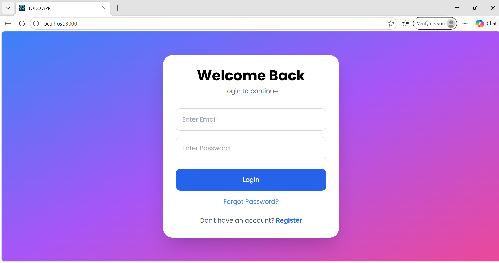
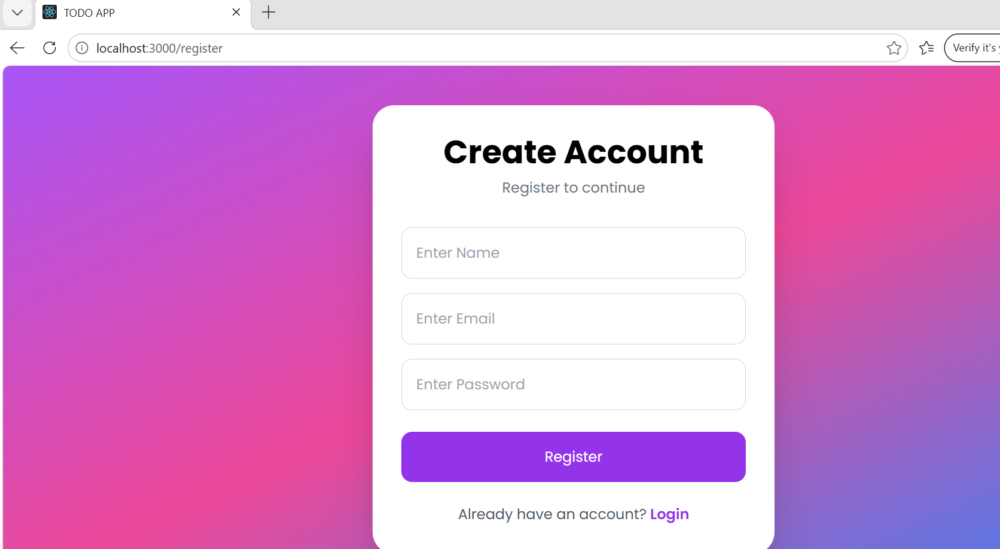
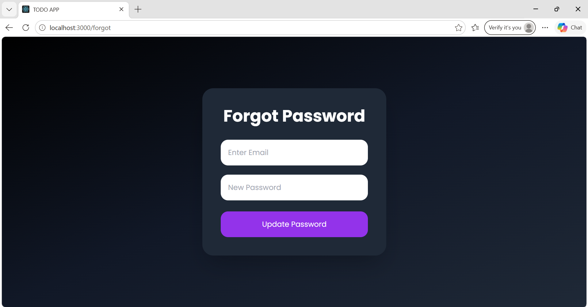
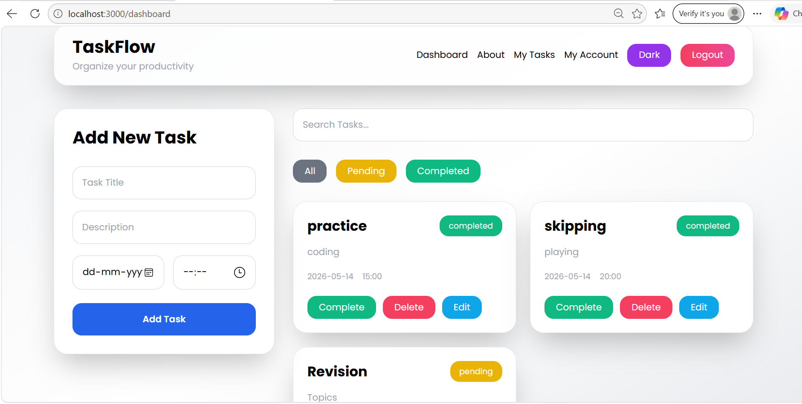
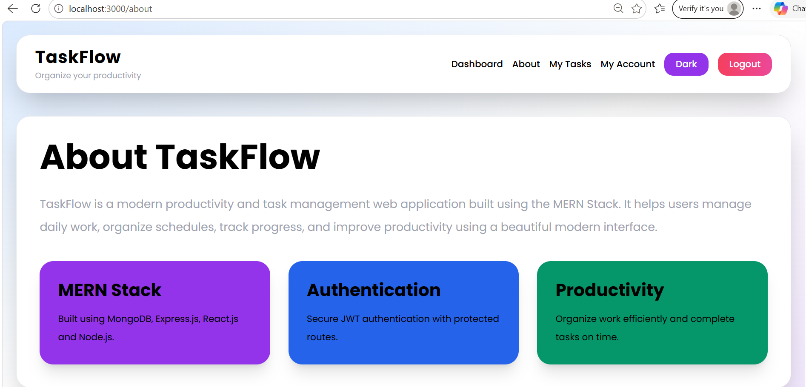
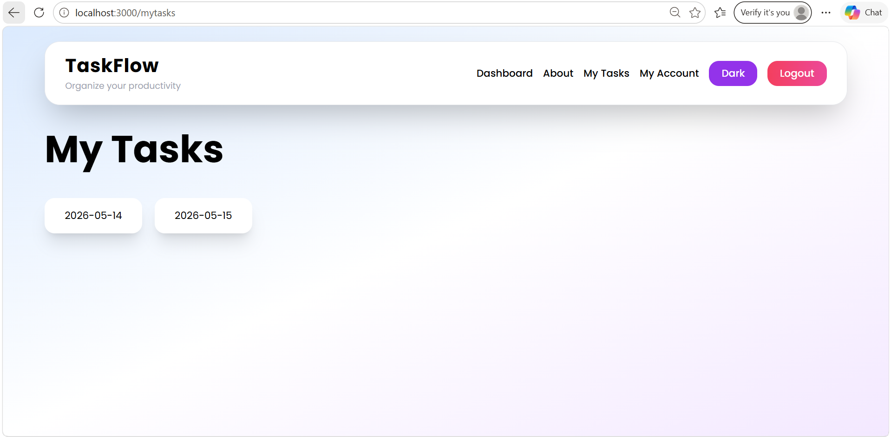
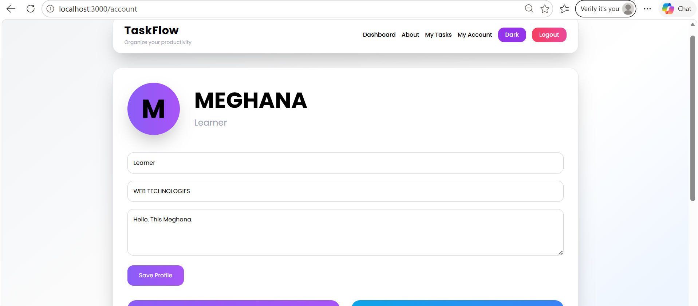
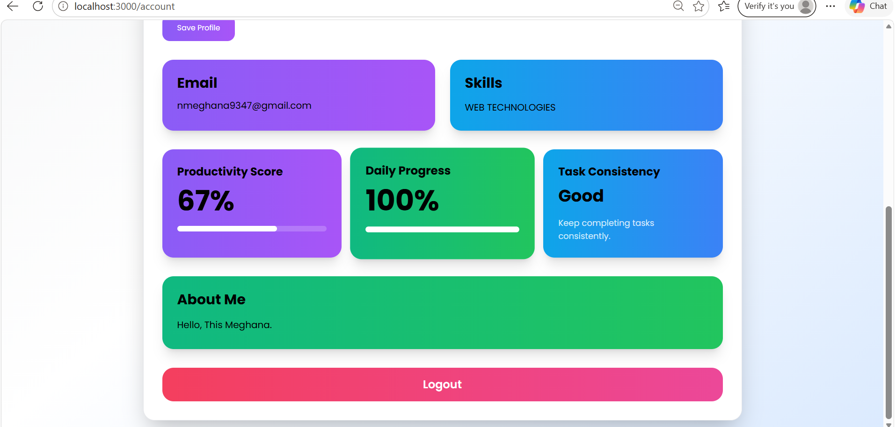

# 🚀 TaskFlow - MERN Productivity App

TaskFlow is a modern full-stack productivity and task management web application built using the MERN Stack.  
It helps users organize daily tasks, track progress, improve productivity, and manage schedules with a clean modern UI.

---

# 🌐 Live Demo

Coming Soon...

---

# ✨ Features

## 🔐 Authentication System
- User Registration
- Secure Login
- JWT Authentication
- Persistent Login
- Forgot Password
- Logout Functionality

---

## 📋 Task Management
- Add Tasks
- Edit Tasks
- Delete Tasks
- Mark Tasks as Completed
- Search Tasks
- Filter Tasks
- Daily Task Organization

---

## ⏰ Smart Reminder System
- Reminder 15 minutes before task
- Reminder at exact task time
- Browser Notification Support

---

## 👤 User Profile
- Custom Role
- Skills Section
- Bio/About Me
- Productivity Score
- Daily Progress Tracking
- Task Consistency Analytics

---

## 🎨 UI/UX Features
- Fully Responsive Design
- Modern Professional UI
- Dark Mode
- Smooth Animations
- Framer Motion Transitions
- Mobile Friendly Layout

---

# 🛠️ Tech Stack

## Frontend
- React.js
- Tailwind CSS
- Axios
- Framer Motion
- React Router DOM
- React Toastify

## Backend
- Node.js
- Express.js
- MongoDB
- Mongoose
- JWT Authentication
- bcryptjs

---

# 📸 Screenshots

## 🔑 Login Page



---

## 📝 Register Page



---

## 🔒 Forgot Password



---

## 📊 Dashboard



---

## ℹ️ About Page



---

## 📅 My Tasks Page



---

## 👤 My Account Page





---

# 🚀 Installation

## Clone Repository

```bash
git clone YOUR_GITHUB_LINK
```

---

## Frontend Setup

```bash
cd frontend
npm install
npm start
```

---

## Backend Setup

```bash
cd backend
npm install
npm start
```

---

# 🔑 Environment Variables

Create `.env` file inside backend folder.

```env
MONGO_URL=your_mongodb_url
JWT_SECRET=your_secret_key
```

---

# 📈 Future Improvements

- Email OTP Verification
- Calendar Integration
- Drag & Drop Tasks
- Priority Levels
- Task Categories
- Team Collaboration
- AI Productivity Suggestions
- PWA Support
- Cloud Deployment
- Push Notifications

---

# 👩‍💻 Developer

### Meghana Nimmaluri

- MERN Stack Developer
- Passionate about Full Stack Development
- Interested in building modern scalable applications

---

# ⭐ Project Highlights

- Full MERN Stack Project
- Authentication & Authorization
- Responsive Modern UI
- Real-world Productivity Application
- Advanced User Experience
- Notification System
- Analytics Dashboard

---

# 📌 License

This project is licensed under the MIT License.